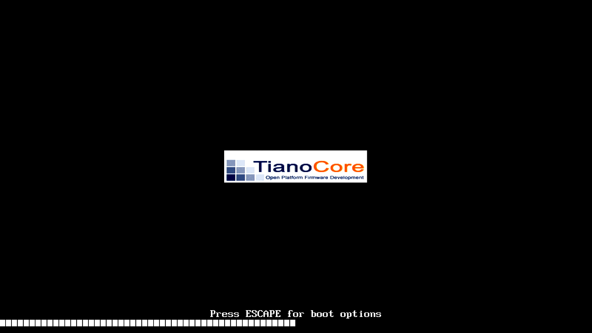
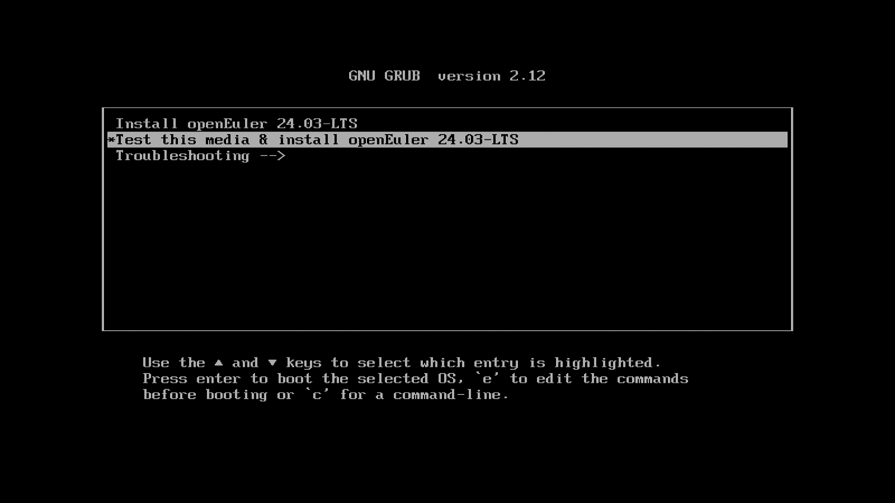
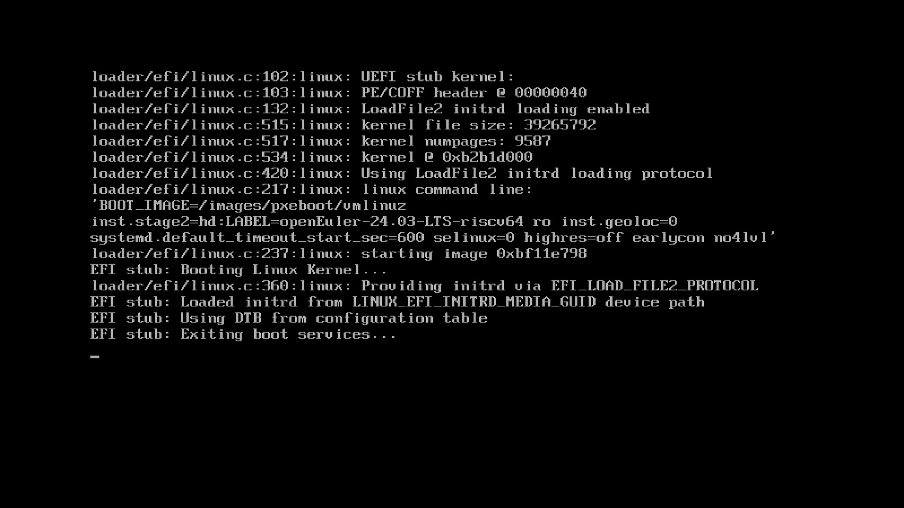

# 在 Milk-V Pioneer 上安装基于UEFI启动流程的 openEuler 24.03

Pioneer 出厂时 NOR Flash 固件没有支持基于 EDK2 的 UEFI 启动流程，因此需要首先部署 EDK2 固件。之后则可以使用 openEuler 官方发布的ISO安装镜像执行系统安装。

鉴于 Pioneer 的主控 SG2042 会优先从 SD 卡加载固件，其次才会尝试从板载 NOR Flash 上加载，因此本文档基于：

- 在 microSD 卡上部署 UEFI 固件
- 将 ISO 安装镜像烧录至U盘
- 系统安装至 M.2 NVMe 硬盘上

的思路来部署 openEuler RISC-V。

## 部署固件至 microSD

下载 `sg2042_firmware_uefi.img.zip`。解压得到 `sg2042_firmware_uefi.img` 磁盘镜像。

将该镜像恢复到 microSD 卡中。使用 `dd` 命令如下：

```shell
export MICROSD_DEV="/dev/sdX"
sudo dd if=sg2042_firmware_uefi.img of="${MICROSD_DEV}" bs=512k conv=fsync status=progress oflag=direct
```

将 `sdX` 替换为实际的 SD 卡块设备路径。

或使用图形化的工具例如：

- gnome-disks
- [balenaEtcher](https://etcher.balena.io/#download-etcher)

## 部署 ISO 系统安装镜像至 U盘

下载 `openEuler-24.03-LTS-riscv64-dvd.iso`。

使用上述工具将该镜像写入至U盘。以 `dd` 为例：

```shell
sudo dd if=openEuler-24.03-LTS-riscv64-dvd.iso of="${MICROSD_DEV}" bs=512k conv=fsync status=progress oflag=direct
```

## 启动系统

将 microSD 卡插入板载的卡槽。将U盘接入板上任意一个 USB-A 接口。

接一套键鼠到板载 USB-A 口。

确保 AMD R5 230 显卡已接入，并通过线缆连接一台支持 1080P/2K 分辨率的显示器；以及目标 NMVe SSD 接在 M.2 插槽或通过转接卡接在 PCIe 插槽上。

给系统上电。



将会进入 grub 启动项选择界面。



由于固件实现上的缺陷，当前 GRUB 渲染速度很慢，因此需要等待较长时间才能观测到对用户输入的响应。摁方向上键选中 `Install openEuler 24.03 LTS`，回车确认。



